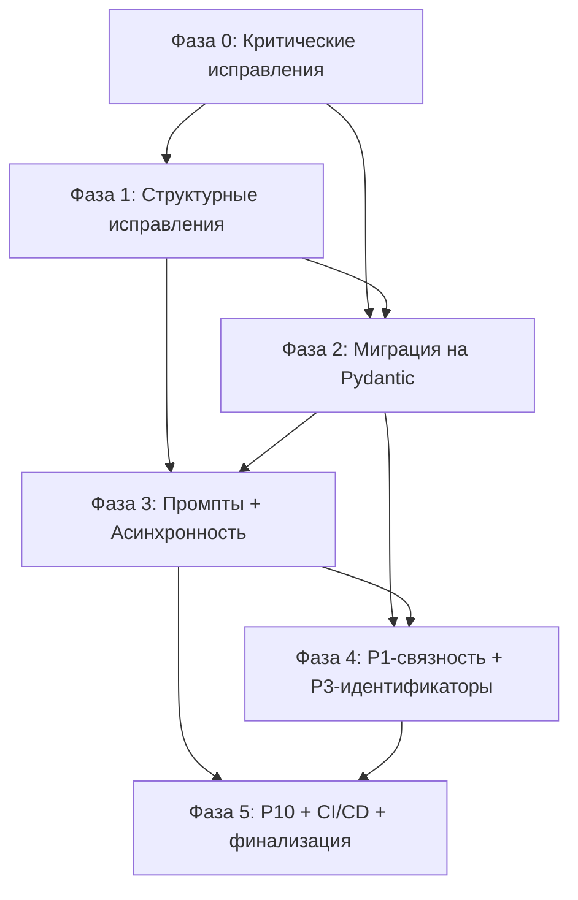

# План приведения проекта в соответствие с CONSTITUTION.md

> Версия: 1.0
> Дата: 2026-07-23
> Статус: Переходный период (секция 5.3)
> Текущее покрытие spec-ами: 35 файлов документируют состояние «как есть»

## 1. Сводка текущего состояния

| Сервис | SERVICE.md | Data Models | Features | Pipelines | Итого spec-файлов | Статус |
|--------|-----------|-------------|----------|-----------|-------------------|--------|
| `app` | ✅ (7 exceptions) | 4 (embeddings, reranker, data-model, settings) | 4 (upload-pdf, ask-document, collections, pdf-rendering, document-management) | 2 (ingestion, qa) | 12 | Документирован «как есть» |
| `semantic_graph` | ✅ (7 exceptions) | 4 (entity, document, region, config) | 3 (process-document, clastrize-graph, create-community-report) | 3 (entity-extraction, clustering, community-report) | 11 | Документирован «как есть» |
| `documet_index` | ✅ (6 exceptions) | 2 (document, region) | — | 1 (document-to-graph) | 4 | Документирован «как есть» |
| `mineru` | ✅ (5 exceptions) | 1 (process-response) | 1 (process-pdf) | 1 (pdf-processing) | 4 | Документирован «как есть» |
| `qdrant` | ✅ (6 exceptions) | 1 (search-models) | 2 (search, upsert) | — | 4 | Документирован «как есть» |

**Всего**: 35 spec-файлов, 31 задокументированное исключение из Constitution.

## 2. Выявленные нарушения по принципам Constitution

### P1. Сервисные границы священны

| ID | Сервис | Файл/модуль | Описание | Приоритет | Трудоёмкость |
|----|--------|------------|----------|-----------|-------------|
| P1-01 | `app` | `api.py:upload_pdf()` | Hardcoded URL `http://localhost:9595/process-document` вместо Pydantic Settings для вызова semantic_graph | Critical | S |
| P1-02 | `semantic_graph` | `dtype/document.py`, `dtype/region.py` | Полный дубликат моделей `Document`, `Region`, `BBox`, `Style` из `documet_index` — нарушение границ: document-модели принадлежат `documet_index` | Critical | M |
| P1-03 | `semantic_graph` | `neo4j_service.py` (`DocumentIndexService`) | Дублирует функциональность `documet_index` — строит Document Graph, создаёт `Region:*` узлы (вторжение в зону documet_index) | High | M |
| P1-04 | `documet_index` | `manager.py:delete_all_documents()` | `DETACH DELETE` всех узлов удаляет оба графа (document + semantic). Должен удалять только узлы `Document` и `Region:*` | Critical | S |
| P1-05 | `qdrant` | `api.py`, `config/settings.py` | `QDRANT_URL` = `settings.host:settings.port` (`0.0.0.0:8000`) — указывает на FastAPI-обёртку, а не на порт Qdrant (6333). Расхождение с Docker-образом | High | S |

### P2. file_hash как единый идентификатор документа

| ID | Сервис | Файл/модуль | Описание | Приоритет | Трудоёмкость |
|----|--------|------------|----------|-----------|-------------|
| P2-01 | `app` | `api.py:upload_pdf()` | Вызов semantic_graph передаёт `document_id` = `file_hash`, но Constitution I1 требует `text_unit_ids` (производный от `file_hash`) | Medium | S |
| P2-02 | `qdrant` | `api.py` (upsert) | Нет валидации наличия `file_hash` в payload точек при upsert. Constitution P2 требует обязательного `file_hash` | High | S |
| P2-03 | `qdrant` | `api.py` (search) | `limit=5` захардкожен, query_vector size=4 — демонстрационные значения вместо реальных (I3: коллекция `documents`, 2048-dim) | High | S |

### P3. Сквозной идентификатор региона — `file_hash|region_id`

| ID | Сервис | Файл/модуль | Описание | Приоритет | Трудоёмкость |
|----|--------|------------|----------|-----------|-------------|
| P3-01 | `documet_index` | `dtype/document.py` | Идентификатор региона — порядковый `element_index`, не композитный `file_hash|region_id`. Связь с Qdrant не формализована | Medium | M |
| P3-02 | `qdrant` | `api.py` (upsert) | Нет валидации наличия `region_id` в payload точек. Constitution P3 требует `region_id` в каждой точке | High | S |

### P4. Два графа Neo4j — два набора данных

| ID | Сервис | Файл/модуль | Описание | Приоритет | Трудоёмкость |
|----|--------|------------|----------|-----------|-------------|
| P4-01 | `semantic_graph` | `neo4j_service.py` | Создаёт узлы `Document`, `Region:*` (document graph) — вторгается в зону `documet_index` | High | M |
| P4-02 | `documet_index` | `manager.py:delete_all_documents()` | `DETACH DELETE` удаляет ВСЕ узлы — уничтожает semantic graph при вызове из document graph | Critical | S |

### P5. Асинхронность для I/O-bound операций

| ID | Сервис | Файл/модуль | Описание | Приоритет | Трудоёмкость |
|----|--------|------------|----------|-----------|-------------|
| P5-01 | `app` | `api.py` | Синхронные вызовы в `async def` upload-pdf: `process_with_mineru()`, `compute_embeddings_for_elements()`, `create_neo4j_graph()`, `requests.post()` — блокировка event loop | Critical | L |
| P5-02 | `app` | `api.py` | Синхронные `def` эндпоинты: GET/POST/DELETE `/collections`, DELETE `/documents`, GET `/uploaded-files` — блокируют event loop | High | M |
| P5-03 | `app` | `api.py:ask_document()` | Синхронный `def`, внутри: `emb_client.get_text_embedding()`, `qdrant_client.search()`, `reranker_client.rerank()`, `llm_client.send_message()` | Critical | L |
| P5-04 | `app` | `qwen3_emb_client.py`, `reranker_client.py`, `llm_client.py` | Все HTTP-клиенты используют синхронную библиотеку `requests` вместо `httpx`/`aiohttp` | Critical | L |
| P5-05 | `app` | `api.py` (pdf-rendering) | `doc.close()` для PyMuPDF не в `finally`-блоке — утечка памяти при ошибке рендеринга | Medium | S |
| P5-06 | `app` | `api.py` (document-management) | `DocumentIndexService.close()` не в `finally` при ошибке `delete_graph` — утечка Neo4j-соединения | Medium | S |
| P5-07 | `semantic_graph` | `Qdrant_extractor/` | `QdrantStreamAdapter.build_chunks_dataframe()` использует синхронный `requests` для scroll Qdrant | High | M |
| P5-08 | `documet_index` | `manager.py`, `neo4j_service.py` | Neo4j-драйвер используется синхронно (`session.run()`). Должен быть `AsyncGraphDatabase` | High | M |

### P6. Pydantic — источник истины для моделей данных

| ID | Сервис | Файл/модуль | Описание | Приоритет | Трудоёмкость |
|----|--------|------------|----------|-----------|-------------|
| P6-01 | `app` | `api.py` | `QuestionResponse.answers` = `List[Dict[str, Any]]` вместо строгой модели `SearchHit` | High | M |
| P6-02 | `app` | `api.py` | Ответы POST/DELETE `/collections`, DELETE `/documents` = `Dict[str, Any]` вместо Pydantic-моделей | High | M |
| P6-03 | `app` | `api.py` | `HealthCheckResponse.services` = `Dict[str, str]` вместо типизированной модели | Medium | S |
| P6-04 | `app` | `api.py:get_uploaded_files()` | `UploadedFileInfo` инстанциируется с полями `file_name`, `s3_path`, которых нет в Pydantic-модели | Critical | S |
| P6-05 | `app` | `schemas/`, `utils/data_model.py` | Модели размещены в `schemas/` и `utils/`, а не в `dtype/` как требует N2 | High | M |
| P6-06 | `app` | `api.py` (pdf-rendering) | Ответы `/api/pdf/{hash}/info` и `/api/pdf/{hash}/mineru-bboxes` — `dict` без `response_model` | Medium | S |
| P6-07 | `semantic_graph` | `dtype/document.py`, `dtype/region.py` | `Document`, `Region`, `Style`, `BBox` — plain Python классы, не Pydantic | High | M |
| P6-08 | `documet_index` | `dtype/document.py`, `dtype/region.py` | `Document`, `Region`, `Style`, `BBox`, `ManagerConfig` — plain Python классы, не Pydantic | High | L |
| P6-09 | `documet_index` | `manager.py` | `ManagerConfig` — plain класс, не Pydantic `BaseSettings` | Medium | S |
| P6-10 | `mineru` | `api.py` | `ProcessResponse` и `StatusResponse` определены в `api.py`, не в `dtype/` | High | S |
| P6-11 | `mineru` | `manager.py` | `ProcessingConfig` — `@dataclass`, не Pydantic-модель | Medium | S |
| P6-12 | `mineru` | `api.py:dtype/process-response.py` | `ProcessResponse.results` = `Optional[Dict[str, Any]]` — ослабленная типизация | Medium | S |
| P6-13 | `qdrant` | `api.py` (search, upsert) | Вход — `list[dict]`, выход — `dict`, без Pydantic-моделей вообще | Critical | M |
| P6-14 | `app` | `schemas/embeddings.py`, `schemas/reranker.py` | Конфликт имён: два разных Pydantic класса с именем `Message` в одном сервисе | Low | S |

### P7. Промпты вынесены из кода в файлы

| ID | Сервис | Файл/модуль | Описание | Приоритет | Трудоёмкость |
|----|--------|------------|----------|-----------|-------------|
| P7-01 | `app` | `api.py:1599-1676` | LLM system prompt + user prompt для `/ask-document` — строковые константы в коде | Critical | M |
| P7-02 | `semantic_graph` | `config.py:179-468` | 5 промптов: `GRAPH_EXTRACTION_PROMPT`, `SUMMARIZE_PROMPT`, `COMMUNITY_REPORT_PROMPT`, `CONTINUE_PROMPT`, `LOOP_PROMPT` — строковые константы | Critical | M |
| P7-03 | `semantic_graph` | — | Отсутствует директория `prompts/` | High | S |
| P7-04 | `app` | — | Отсутствует директория `prompts/` | High | S |

### P8. Spec-first

| ID | Сервис | Файл/модуль | Описание | Приоритет | Трудоёмкость |
|----|--------|------------|----------|-----------|-------------|
| P8-01 | Все | — | Для новых фич (после завершения Фазы 0): придерживаться строгого spec-first. Нарушений нет — документирование «как есть» выполнено. | — | — |

### P9. Семантический граф глобален

Нарушений нет. Осознанное архитектурное решение. Однако **следствия P9** требуют:
- Реализовать механизм перестроения сообществ при добавлении новых документов
- Реализовать P10 (мягкое удаление) для корректной обработки удаления документов из глобального графа

### P10. Мягкое удаление из семантического графа

| ID | Сервис | Файл/модуль | Описание | Приоритет | Трудоёмкость |
|----|--------|------------|----------|-----------|-------------|
| P10-01 | `semantic_graph` | `manager.py` | Флаг `archived` на узлах `Entity` и связях `RELATED` отсутствует | Critical | L |
| P10-02 | `semantic_graph` | `manager.py:get_entities()` | Не фильтрует по `archived` — все сущности участвуют в кластеризации и отчётах | Critical | L |
| P10-03 | `semantic_graph` | `manager.py:get_entity_relationships()` | Не фильтрует по `archived` — все связи участвуют в кластеризации | Critical | L |
| P10-04 | `semantic_graph` | `manager.py:get_community()` | Не фильтрует по `archived` — archived-сущности попадают в отчёты сообществ | Critical | L |
| P10-05 | `semantic_graph` | `manager.py:delete_all_documents()` | `DETACH DELETE` всех узлов — физическое удаление вместо мягкого | Critical | L |
| P10-06 | `app` | `api.py` (document-management) | `DELETE /documents/{file_hash}` вызывает `delete_graph()` (физическое удаление Document/Region) — допустимо для document graph, но не вызывает мягкого удаления в semantic graph | High | M |

## 3. Дополнительные проблемы (не только принципы)

### N2. Структура модулей

| ID | Сервис | Описание | Приоритет | Трудоёмкость |
|----|--------|----------|-----------|-------------|
| N2-01 | `app` | Модели в `src/schemas/` и `src/utils/data_model.py`, а не в `dtype/`. Нет `manager.py` | High | L |
| N2-02 | `semantic_graph` | Модели в `dtype/` (структура ✓), но нет `src/`, нет `manager.py` как отдельного слоя | Medium | M |
| N2-03 | `documet_index` | Нет `config/settings.py` — конфигурация через `dotenv` + plain классы. Нет `src/` | Medium | M |
| N2-04 | `mineru` | Pydantic-модели в `api.py`, нет `dtype/`. Нет `manager.py` (есть `manager.py` для MinerU, но не для API-логики) | High | M |
| N2-05 | `qdrant` | Нет `dtype/`, нет `manager.py` | High | M |

### N3. Конфигурация не Pydantic Settings

| ID | Сервис | Описание | Приоритет | Трудоёмкость |
|----|--------|----------|-----------|-------------|
| N3-01 | `semantic_graph` | `config.py` — модульные константы, не Pydantic `BaseSettings`. Neo4j-креды читаются из `os.environ` напрямую | High | M |
| N3-02 | `documet_index` | `ManagerConfig` — plain Python класс. Конфигурация через `dotenv` + `os.environ` | High | M |

### Дубликаты кода

| ID | Описание | Приоритет | Трудоёмкость |
|----|----------|-----------|-------------|
| DUP-01 | `semantic_graph/dtype/` → полный дубликат `documet_index/dtype/` (Document, Region, Style, BBox) | Critical | M |
| DUP-02 | `semantic_graph/neo4j_service.py` → дублирует `documet_index/neo4j_service.py` (DocumentIndexService) | High | M |
| DUP-03 | `semantic_graph/req2.txt` → дубликат `semantic_graph/requirements.txt` (233 строки) | Low | S |
| DUP-04 | `app/config/settings.py` → дублирование полей между `Settings` (агрегат) и вложенными `*Settings` с разными дефолтами (EMBEDDING_BASE_URL: порт 10114 vs 10115) | High | M |

### Баги

| ID | Сервис | Описание | Приоритет | Трудоёмкость |
|----|--------|----------|-----------|-------------|
| BUG-01 | `app` | `reranker.Message.add_img_content()` — trailing comma создаёт кортеж `('image_url',)` вместо строки | High | S |
| BUG-02 | `app` | `UploadedFileInfo` инстанциируется с полями `file_name` и `s3_path`, которых нет в Pydantic-модели | Critical | S |
| BUG-03 | `app` | `doc.close()` не в `finally` при рендеринге PDF — утечка памяти | Medium | S |
| BUG-04 | `app` | `DocumentIndexService.close()` не вызывается при ошибке `delete_graph` — утечка соединения | Medium | S |
| BUG-05 | `mineru` | Ошибка инференса логируется как «Ошибка чтения файла» — неверное сообщение (строка 139 `api.py`) | Medium | S |
| BUG-06 | `app` | `Settings` агрегат дублирует поля вложенных `*Settings` с разными дефолтами — `EMBEDDING_BASE_URL` расходится (10114 vs 10115) | High | S |
| BUG-07 | `qdrant` | `QDRANT_URL` формируется как `host:port` (0.0.0.0:8000), что указывает на FastAPI-обёртку, а не Qdrant Server (6333) | High | S |
| BUG-08 | `documet_index` | Cypher-инъекция: `Manager.add_document()` строит запрос конкатенацией строк с ручным экранированием `' → \\'` | High | S |
| BUG-09 | `semantic_graph` | `Document.__parser_mineru` — dead code (недостижимый цикл после return) | Low | S |
| BUG-10 | `semantic_graph` | `TOKENIZER_URL` и `LLM_URL` дублируются в `config.py` с разными значениями | Low | S |

### Инфраструктурные проблемы

| ID | Описание | Приоритет | Трудоёмкость |
|----|----------|-----------|-------------|
| INF-01 | Отсутствует CI/CD (`.github/workflows/`) — нет автоматических проверок OpenAPI-контрактов, spec-соответствия, тестов | High | M |
| INF-02 | Отсутствует `pyproject.toml` / `Makefile` для унификации управления зависимостями и задачами | Medium | M |
| INF-03 | `mineru` README описывает несуществующие эндпоинты (`/status/{task_id}`, `/download/`, `/cleanup/`) | Low | S |
| INF-04 | `semantic_graph/dtype/region.py` — `Style.__lt__` с инвертированной семантикой (A < B означает «A может быть родителем B») | Low | S |
| INF-05 | `qdrant` — демонстрационные значения: коллекция `my_collection`, `dim=4`, `limit=5` — должны соответствовать I3 (`documents`, `2048`, динамический) | High | M |

## 4. Фазовый план исправления

### Фаза 0: Критические исправления (1-2 недели)

Цель: устранить критические баги и нарушения, угрожающие корректности/безопасности системы.

#### Задача 0.1: Исправить баг UploadedFileInfo (BUG-02, P6-04)
- **Сервис**: `app`
- **Файлы**: `app/src/utils/data_model.py` (добавить поля `file_name`, `s3_path`), `app/src/api.py` (исправить конструктор)
- **Принцип**: P6
- **Трудоёмкость**: S (1 файл, ~5 строк)

#### Задача 0.2: Исправить баг add_img_content с trailing comma (BUG-01)
- **Сервис**: `app`
- **Файлы**: `app/src/schemas/reranker.py`
- **Принцип**: P6 (баг в Pydantic-модели)
- **Трудоёмкость**: S (1 строка)

#### Задача 0.3: Исправить Settings-дублирование полей (BUG-06, DUP-04)
- **Сервис**: `app`
- **Файлы**: `app/config/settings.py` — удалить дублирующие алиасы из `Settings`, оставить только вложенные объекты
- **Принцип**: P6, N3
- **Трудоёмкость**: S (рефакторинг 20-30 строк, обновить импорты в клиентах)

#### Задача 0.4: Добавить Pydantic-модели для ответов Qdrant-обёртки (P6-13, INF-05)
- **Сервис**: `qdrant`
- **Файлы**: создать `qdrant/dtype/search.py`, `qdrant/dtype/upsert.py`; обновить `qdrant/api.py`
- **Принцип**: P6
- **Трудоёмкость**: M (4 новых файла, обновление 2 эндпоинтов)

#### Задача 0.5: Исправить параметры Qdrant-обёртки на соответствие I3 (P2-03, P3-02, BUG-07, INF-05)
- **Сервис**: `qdrant`
- **Файлы**: `qdrant/config/settings.py` (добавить `collection_name`, `vector_size`), `qdrant/api.py` (использовать `Settings`, убрать хардкод dim=4, limit=5, "my_collection"); исправить `QDRANT_URL` на порт 6333
- **Принцип**: P2, P3, I3
- **Трудоёмкость**: M

#### Задача 0.6: Исправить баг с ошибкой в mineru (BUG-05)
- **Сервис**: `mineru`
- **Файлы**: `mineru/api.py` — заменить фиксированное сообщение «Ошибка чтения файла» на различающее этапы
- **Принцип**: —
- **Трудоёмкость**: S (1 файл, ~5 строк)

#### Задача 0.7: Исправить утечку соединений Neo4j в app (BUG-04)
- **Сервис**: `app`
- **Файлы**: `app/src/api.py` — обернуть `DocumentIndexService` в `try/finally` с гарантированным `close()`
- **Принцип**: P5
- **Трудоёмкость**: S

#### Задача 0.8: Исправить утечку PyMuPDF doc.close() (BUG-03)
- **Сервис**: `app`
- **Файлы**: `app/src/api.py` (pdf-rendering) — перенести `doc.close()` в `finally`
- **Принцип**: P5
- **Трудоёмкость**: S

#### Задача 0.9: Добавить Pydantic-модели для ответов app (P6-01, P6-02, P6-03, P6-06)
- **Сервис**: `app`
- **Файлы**: создать/обновить модели в `app/src/utils/data_model.py` (переименовать в `app/src/dtype/`): `SearchHit` для `QuestionResponse.answers`, `CollectionCreateResponse`, `CollectionDeleteResponse`, `DocumentDeleteResponse`, `PDFInfoResponse`, `MinerUBBoxResponse`
- **Принцип**: P6
- **Трудоёмкость**: M (6 новых моделей, обновление 6 эндпоинтов)

#### Задача 0.10: Исправить P1-04, P4-02 — documet_index delete_all_documents удаляет оба графа
- **Сервис**: `documet_index`
- **Файлы**: `documet_index/manager.py` — заменить `DETACH DELETE` на `MATCH (d:Document)-[*0..]->(r:Region) DETACH DELETE d, r`
- **Принцип**: P1, P4
- **Трудоёмкость**: S (1 Cypher-запрос)

#### Задача 0.11: Исправить Cypher-инъекцию (BUG-08)
- **Сервис**: `documet_index`
- **Файлы**: `documet_index/manager.py` — перейти на параметризованные запросы Neo4j (`$param`)
- **Принцип**: P6 (валидация)
- **Трудоёмкость**: S (рефакторинг 1 метода)

---

### Фаза 1: Структурные исправления (2-4 недели)

Цель: привести структуру модулей в соответствие с N2, устранить дубликаты кода.

#### Задача 1.1: Удалить дубликаты dtype/ из semantic_graph (P1-02, DUP-01)
- **Сервис**: `semantic_graph`
- **Файлы**: удалить `semantic_graph/dtype/document.py`, `semantic_graph/dtype/region.py`; заменить импорты на `documet_index.dtype.*`
- **Принцип**: P1, P6
- **Трудоёмкость**: M
- **Зависит от**: ничего (модели `documet_index` уже стабильны)

#### Задача 1.2: Удалить semantic_graph/neo4j_service.py (P1-03, DUP-02)
- **Сервис**: `semantic_graph`
- **Файлы**: удалить `semantic_graph/neo4j_service.py`; удалить импорты в других модулях
- **Принцип**: P1, P4
- **Трудоёмкость**: M (проверка всех импортов, убедиться что не используется в основных пайплайнах)
- **Зависит от**: Задача 1.1

#### Задача 1.3: Реорганизация структуры app (N2-01, P6-05)
- **Сервис**: `app`
- **Файлы**: 
  - Переместить `app/src/schemas/embeddings.py` → `app/src/dtype/embeddings.py`
  - Переместить `app/src/schemas/reranker.py` → `app/src/dtype/reranker.py`
  - Переместить `app/src/utils/data_model.py` → `app/src/dtype/core.py`
  - Создать `app/src/manager.py` для бизнес-логики (ingestion, qa, collections, pdf-rendering)
- **Принцип**: N2, P6
- **Трудоёмкость**: L (затрагивает все эндпоинты, все импорты)
- **Зависит от**: Задача 0.9 (Pydantic-модели для ответов уже созданы)

#### Задача 1.4: Реорганизация структуры mineru (N2-04)
- **Сервис**: `mineru`
- **Файлы**: создать `mineru/dtype/`, переместить `ProcessResponse`, `StatusResponse` из `api.py`; опционально: создать `mineru/manager.py` для API-логики
- **Принцип**: N2, P6
- **Трудоёмкость**: M

#### Задача 1.5: Реорганизация структуры qdrant (N2-05)
- **Сервис**: `qdrant`
- **Файлы**: завершить создание `qdrant/dtype/` (модели уже из Задачи 0.4); создать `qdrant/manager.py` для поиска и upsert
- **Принцип**: N2
- **Трудоёмкость**: S (dtype уже создан в Фазе 0)

#### Задача 1.6: Удалить req2.txt, dead code, несоответствия README (DUP-03, BUG-09, INF-03)
- **Сервисы**: `semantic_graph`, `mineru`
- **Файлы**: удалить `semantic_graph/req2.txt`; удалить dead code в `semantic_graph/dtype/document.py:__parser_mineru` (уже удалён в 1.1); обновить `mineru/README.md` — убрать несуществующие эндпоинты; удалить неиспользуемый `StatusResponse` словарь `tasks` из `mineru/api.py`
- **Принцип**: —
- **Трудоёмкость**: S

---

### Фаза 2: Миграция на Pydantic (2-3 недели)

Цель: привести ВСЕ модели данных к Pydantic, включая plain Python классы в `documet_index` и `semantic_graph`.

#### Задача 2.1: Pydantic-изация documet_index моделей (P6-08, P6-09)
- **Сервис**: `documet_index`
- **Файлы**: преобразовать `dtype/document.py` (`Document`, функция `create_graph_from_mineru_result` → метод класса), `dtype/region.py` (`BBox`, `Style`, `Region`) в Pydantic `BaseModel` с валидаторами
- **Принцип**: P6
- **Трудоёмкость**: L (~400 строк, валидаторы для bbox, style, labels)
- **Зависит от**: Фаза 1 (структура стабилизирована)

#### Задача 2.2: Pydantic Settings для documet_index (N3-02)
- **Сервис**: `documet_index`
- **Файлы**: создать `documet_index/config/settings.py` — Pydantic `BaseSettings` для Neo4j URI, user, password, name_db
- **Принцип**: N3
- **Трудоёмкость**: S (1 файл, ~30 строк)
- **Зависит от**: Задача 2.1 (модели стабильны)

#### Задача 2.3: Pydantic Settings для semantic_graph (N3-01)
- **Сервис**: `semantic_graph`
- **Файлы**: заменить `semantic_graph/config.py` (модульные константы) на `semantic_graph/config/settings.py` (Pydantic `BaseSettings`). Вынести константы `ENTITY_TYPES`, `CONTENT_LABELS`, column schemas в отдельный `constants.py`
- **Принцип**: N3
- **Трудоёмкость**: M (~200 строк конфигурации мигрировать, обновить импорты во всех модулях)
- **Зависит от**: Задача 2.4 (промпты уже вынесены)

#### Задача 2.4: Исправить ProcessingConfig (P6-11)
- **Сервис**: `mineru`
- **Файлы**: преобразовать `mineru/manager.py:ProcessingConfig` из `@dataclass` в Pydantic `BaseModel`
- **Принцип**: P6
- **Трудоёмкость**: S

#### Задача 2.5: Ужесточить типизацию ProcessResponse (P6-12)
- **Сервис**: `mineru`
- **Файлы**: заменить `Dict[str, Any]` в `ProcessResponse.results` на строгую Pydantic-модель `MinerUResult`
- **Принцип**: P6
- **Трудоёмкость**: M

#### Задача 2.6: Разрешить конфликт имён Message (P6-14)
- **Сервис**: `app`
- **Файлы**: переименовать `schemas/embeddings.py:Message` → `EmbeddingMessage`, `schemas/reranker.py:Message` → `RerankerMessage`
- **Принцип**: P6
- **Трудоёмкость**: S

---

### Фаза 3: Вынос промптов + Асинхронность (2-3 недели)

Цель: устранить нарушения P7 (промпты в коде) и P5 (синхронные I/O операции).

#### Задача 3.1: Вынести промпты app (P7-01, P7-04)
- **Сервис**: `app`
- **Файлы**: создать `app/prompts/qa-system.md`, `app/prompts/qa-user.md`; добавить загрузчик промптов (`app/src/prompt_loader.py`); обновить `api.py:ask_document()` для загрузки из файлов
- **Принцип**: P7
- **Трудоёмкость**: M
- **Зависит от**: Задача 1.3 (структура создана)

#### Задача 3.2: Вынести промпты semantic_graph (P7-02, P7-03)
- **Сервис**: `semantic_graph`
- **Файлы**: создать `semantic_graph/prompts/graph-extraction.md`, `prompts/summarize.md`, `prompts/community-report.md`, `prompts/continue-extraction.md`, `prompts/loop-check.md`; добавить загрузчик промптов; обновить `config.py`/`config/settings.py` для загрузки из файлов; обновить `graphrag.py`, `create_community_report.py`
- **Принцип**: P7
- **Трудоёмкость**: M
- **Зависит от**: Задача 2.3 (конфигурация мигрирована на Pydantic Settings)

#### Задача 3.3: Миграция app HTTP-клиентов на async (P5-04)
- **Сервис**: `app`
- **Файлы**: 
  - `qwen3_emb_client.py`: заменить `requests` → `httpx.AsyncClient`
  - `reranker_client.py`: заменить `requests` → `httpx.AsyncClient`
  - `llm_client.py`: заменить синхронный `OpenAI` → `AsyncOpenAI`
  - `mineru_client.py`: заменить `requests` → `httpx.AsyncClient`
- **Принцип**: P5
- **Трудоёмкость**: L (4 клиента, ~800 строк суммарно)

#### Задача 3.4: Миграция app эндпоинтов на async (P5-01, P5-02, P5-03)
- **Сервис**: `app`
- **Файлы**: `api.py`, `manager.py` (созданный в 1.3)
  - `POST /upload-pdf`: заменить синхронные вызовы на `await`
  - `POST /ask-document`: заменить синхронные вызовы на `await`, добавить `asyncio.gather` для параллельных операций
  - Все `/collections` эндпоинты: `def` → `async def`
  - Все `/documents` эндпоинты: `def` → `async def`
  - `GET /uploaded-files`: `def` → `async def`
  - Заменить все синхронные вызовы Qdrant на aiohttp или `run_in_executor`
- **Принцип**: P5
- **Трудоёмкость**: L (затрагивает все эндпоинты app, ~1000 строк)
- **Зависит от**: Задачи 1.3 и 3.3

#### Задача 3.5: Миграция semantic_graph Qdrant-клиента на async (P5-07)
- **Сервис**: `semantic_graph`
- **Файлы**: `Qdrant_extractor/QdrantReader.py`, `Qdrant_extractor/dataframe_builder.py` — заменить синхронный `requests` на `aiohttp`
- **Принцип**: P5
- **Трудоёмкость**: M

#### Задача 3.6: Миграция documet_index на async Neo4j (P5-08)
- **Сервис**: `documet_index`
- **Файлы**: `manager.py`, `neo4j_service.py`, `neo4j_connection.py` — заменить `GraphDatabase.driver` на `AsyncGraphDatabase.driver`, `session.run()` на `await session.run()`
- **Принцип**: P5
- **Трудоёмкость**: L (~500 строк)
- **Зависит от**: Задача 2.1 (модели уже Pydantic)

---

### Фаза 4: P1-связность и P3-идентификаторы (1-2 недели)

Цель: устранить нарушения сервисных границ и обеспечить сквозную идентификацию.

#### Задача 4.1: Вынести URL semantic_graph в настройки app (P1-01)
- **Сервис**: `app`
- **Файлы**: `config/settings.py` — добавить `SemanticGraphSettings` с `SEMANTIC_GRAPH_URL`; `api.py` — использовать настройку вместо hardcoded URL
- **Принцип**: P1, P5
- **Трудоёмкость**: S

#### Задача 4.2: Реализовать сквозную идентификацию региона (P3-01)
- **Сервисы**: `app` (оркестратор), `documet_index`
- **Файлы**: 
  - `app`: при создании региона генерировать `region_id = f"{file_hash}|{element_index}"`, передавать в Qdrant payload и Neo4j
  - `documet_index`: добавить поле `region_id` в `Region` (уже есть `order`, нужно дописать композитный ключ)
- **Принцип**: P3
- **Трудоёмкость**: M
- **Зависит от**: Задача 2.1 (Region — Pydantic-модель)

#### Задача 4.3: Добавить валидацию file_hash + region_id в Qdrant обёртке (P2-02, P3-02)
- **Сервис**: `qdrant`
- **Файлы**: `dtype/upsert.py` — Pydantic-модель `UpsertPoint` с валидаторами обязательных полей `file_hash`, `region_id` в payload
- **Принцип**: P2, P3, P6
- **Трудоёмкость**: S
- **Зависит от**: Задача 0.4

#### Задача 4.4: Исправить несоответствие document_id/text_unit_ids в вызове semantic_graph (P2-01)
- **Сервис**: `app`
- **Файлы**: `api.py:upload_pdf()` — привести вызов `POST /process-document` к контракту I1
- **Принцип**: P1, P2
- **Трудоёмкость**: S

---

### Фаза 5: Мягкое удаление (P10) + CI/CD + финализация (1-2 недели)

Цель: реализовать мягкое удаление, инфраструктуру CI/CD и закрыть оставшиеся проблемы.

#### Задача 5.1: Реализовать мягкое удаление в semantic_graph (P10-01–P10-05)
- **Сервис**: `semantic_graph`
- **Файлы**:
  - `manager.py`: добавить поле `archived: bool = False` в MERGE/CREATE узлов `Entity` и связей `RELATED`
  - `manager.py`: добавить `soft_delete_document(file_hash)` — пометка всех сущностей документа как `archived`
  - `manager.py`: обновить `get_entities()`, `get_entity_relationships()`, `get_community()` — добавить фильтр `WHERE NOT entity.archived`
  - `semantic_index.py`: добавить эндпоинт `POST /soft-delete-document`
  - `api.py`: зарегистрировать новый эндпоинт
- **Принцип**: P10
- **Трудоёмкость**: L (~300 строк, миграция схемы, фильтрация во всех запросах)
- **Зависит от**: Фаза 3 (асинхронность), Фаза 4 (P1-связность)

#### Задача 5.2: Интеграция мягкого удаления в app (P10-06)
- **Сервис**: `app`
- **Файлы**: `api.py:DELETE /documents/{file_hash}` — добавить вызов `POST /soft-delete-document` в semantic_graph
- **Принцип**: P10
- **Трудоёмкость**: S
- **Зависит от**: Задачи 4.1, 5.1

#### Задача 5.3: Создать CI/CD (INF-01)
- **Файлы**: `.github/workflows/ci.yml`
  - Проверка OpenAPI-контрактов (сравнение сгенерированной схемы FastAPI с OpenAPI-фрагментами в spec-файлах)
  - Проверка соответствия code → spec (все эндпоинты имеют Feature Spec)
  - Линтеры (ruff/mypy)
  - Unit-тесты (pytest)
- **Трудоёмкость**: M

#### Задача 5.4: Создать pyproject.toml + Makefile (INF-02)
- **Файлы**: `pyproject.toml` (зависимости, инструменты), `Makefile` (цели: test, lint, spec-check, run-all)
- **Трудоёмкость**: M

#### Задача 5.5: Финальная чистка
- Удалить неиспользуемый `StatusResponse` и словарь `tasks` из `mineru/api.py` (INF-03)
- Удалить закомментированные альтернативные URL из `semantic_graph/config.py` (BUG-10)
- Пересмотреть `Style.__lt__` → заменить на `can_be_parent_of()` или переопределить `__gt__` (INF-04)
- Обновить все README на актуальное состояние
- **Трудоёмкость**: S

---

## 5. Карта зависимостей между фазами

**Ключевые зависимости внутри фаз**:
- Задача 3.4 (async эндпоинты app) зависит от 3.3 (async клиенты) и 1.3 (manager.py создан)
- Задача 3.2 (prompts semantic_graph) зависит от 2.3 (Pydantic Settings)
- Задача 3.6 (async documet_index) зависит от 2.1 (Pydantic-модели)
- Задача 5.1 (P10 мягкое удаление) зависит от Фаз 3 и 4
- Задача 5.2 (интеграция P10 в app) зависит от 4.1 и 5.1

## 6. Критерии завершения переходного периода

Переходный период (Constitution 5.3) считается завершённым при выполнении **всех** следующих условий:

### Соответствие принципам Constitution
- [ ] **P1**: Ни один сервис не обращается к хранилищу другого сервиса напрямую. Все межсервисные URL — в Pydantic Settings. `semantic_graph` не дублирует модели/код `documet_index`.
- [ ] **P2**: `file_hash` присутствует во всех payload Qdrant, Neo4j Document Graph, MinIO. Все новые сущности используют `file_hash` для cross-store идентификации.
- [ ] **P3**: `region_id` = `file_hash|element_index` сквозной во всех хранилищах (Qdrant, Neo4j).
- [ ] **P4**: Запросы к document graph не затрагивают semantic graph и наоборот. `DETACH DELETE` в document graph удаляет только `Document`/`Region:*`.
- [ ] **P5**: Все I/O-bound операции — асинхронные (`async/await`). 0 синхронных HTTP/DB вызовов в `async def`. CPU-bound операции — через `run_in_executor`.
- [ ] **P6**: Все модели данных — Pydantic `BaseModel`. 0 `Dict[str, Any]` как контракты между модулями. Все модели в `dtype/`.
- [ ] **P7**: 0 строковых LLM-промптов в `.py` файлах. 100% промптов — в `prompts/*.md`. Промпты загружаются из файлов.
- [ ] **P8**: Все новые фичи — через spec-first (документирование «как есть» завершено).
- [ ] **P9**: Не требует изменений (осознанное решение).
- [ ] **P10**: Поле `archived` присутствует на всех `Entity` и `RELATED`. Все запросы к semantic graph фильтруют по `archived`. Мягкое удаление реализовано для всего semantic graph.

### Структура модулей
- [ ] **N2**: Каждый сервис имеет: `dtype/` с Pydantic-моделями, `config/settings.py` (Pydantic Settings), `manager.py` (бизнес-логика), `api.py` (только HTTP), `prompts/` (если есть LLM).
- [ ] **N3**: Конфигурация всех сервисов — Pydantic `BaseSettings`. 0 `os.environ.get()` напрямую. 0 модульных констант как конфигурации.

### Инфраструктура
- [ ] `pyproject.toml` в корне проекта — унифицированные зависимости, линтеры, тесты
- [ ] `Makefile` с целями: `test`, `lint`, `spec-check`, `run-all`
- [ ] `.github/workflows/ci.yml` — автоматические проверки при PR
- [ ] CI проверяет соответствие OpenAPI-схем из spec-файлов и сгенерированных FastAPI
- [ ] CI проверяет, что все эндпоинты имеют соответствующий Feature Spec
- [ ] 0 дубликатов файлов между сервисами
- [ ] 0 dead code
- [ ] 0 расхождений README с кодом

### Общее
- [ ] Все 31 исключение из секций Exceptions spec-файлов устранены (или обоснованы как постоянные с Approval)
- [ ] Все критические баги исправлены (BUG-01, BUG-02, BUG-05, BUG-06, BUG-07, BUG-08, P4-02, P5-01, P5-04, P6-04, P6-13, P7-01, P7-02, P10-01–P10-05, DUP-01, DUP-04)
- [ ] Тесты покрывают все эндпоинты и пайплайны (согласно секциям Testing в spec-файлах)

## 7. Оценка суммарной трудоёмкости

| Фаза | Недель | Задач | Критических | Трудоёмкость |
|------|--------|-------|-------------|-------------|
| Фаза 0 | 1-2 | 11 | 11 | S-M |
| Фаза 1 | 2-4 | 6 | 0 | M-L |
| Фаза 2 | 2-3 | 6 | 0 | M-L |
| Фаза 3 | 2-3 | 6 | 0 | L |
| Фаза 4 | 1-2 | 4 | 0 | S-M |
| Фаза 5 | 1-2 | 5 | 0 | M-L |
| **Итого** | **9-16 недель** | **38 задач** | **11** | — |

> **Примечание**: Оценка предполагает 1 разработчика full-time. При параллельной работе 2-3 разработчиков срок может быть сокращён до 6-10 недель за счёт независимости Фаз 1, 2, 3 (после завершения Фазы 0).
